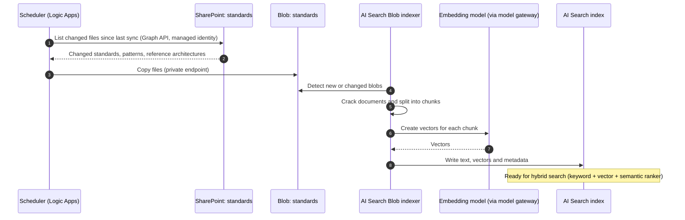
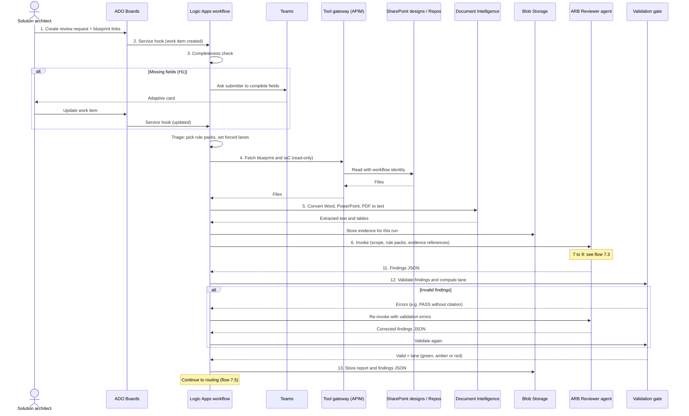
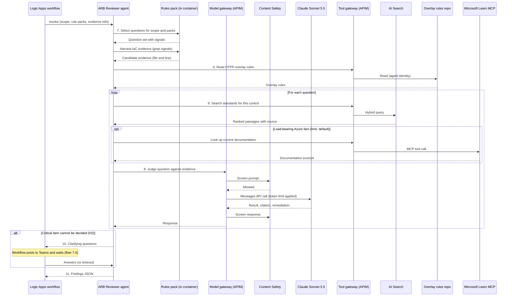
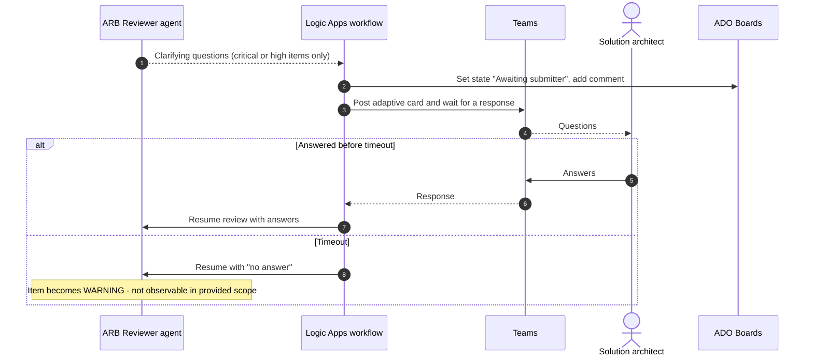
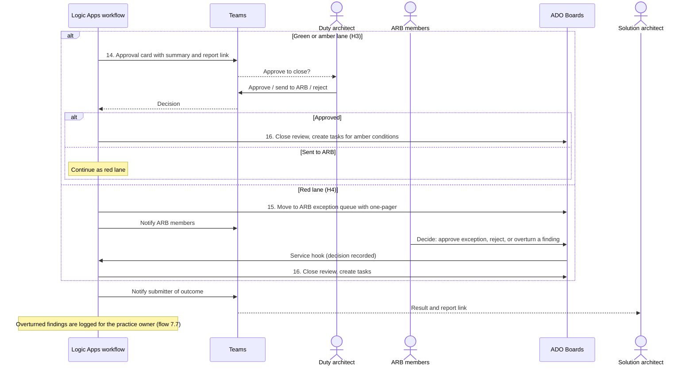
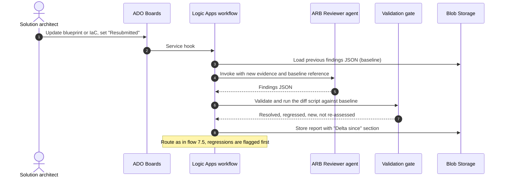
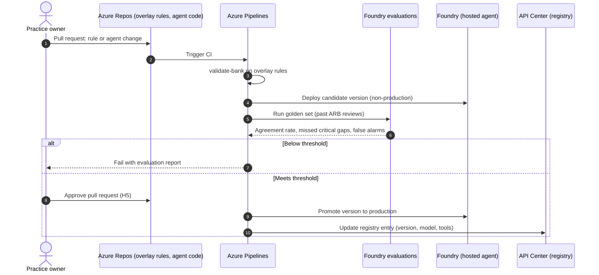
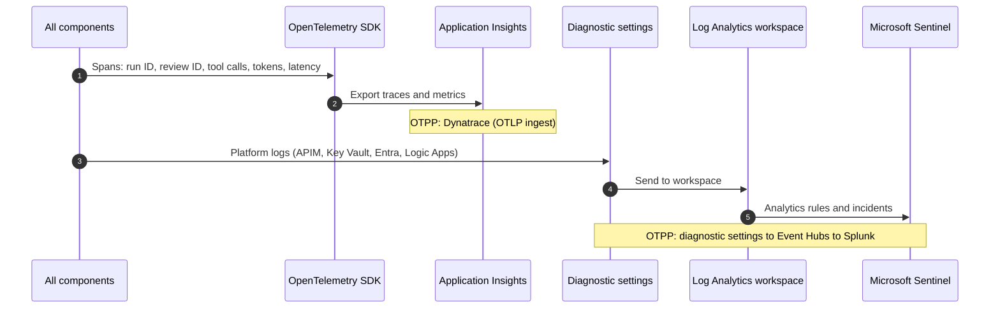

# ARB Agent: Technical Design Document

Supplementary document to the solution architecture diagram ("ARB Agent - Solution Architecture and Data Flow (Azure-native) v2" in Lucid).

| Item | Value |
|---|---|
| Status | Draft for review |
| Date | 4 October 2026 |
| Author | Amit Kumar, Enterprise Architecture |
| Related roadmap items | 1.4 Embedding AI in Architecture Practice; 3.1 Agent Reference Architecture |
| Related documents | Architecture PoV on Agents memo (19 Sep 2026); EA Prioritization deck (Oct 2026); Lucid solution architecture v2 |

---

## 1. Purpose and scope

This document explains how the ARB (Architecture Review Board) agent works in enough detail to build, secure and run it.

**In scope**

- One agent with one job: review a submitted design against OTPP (Ontario Teachers' Pension Plan) architecture standards and recommend an outcome.
- The workflow around it: intake, document gathering, validation, routing, human approval and record keeping.
- The control plane pieces the agent needs: identity, registry, gateways, policy, evaluation and observability.

**Out of scope**

- Agent-assisted architecture development (writing designs). That will be a separate agent.
- Choosing the strategic agentic platform (TAP versus a commercial option). This design is built so it can move there.
- Writing the OTPP rule set itself. That is owned by the architecture practice.

**Important note on technology choices**

The design uses Azure-native services for now, because TAP (Teachers' AI Platform) details are not yet available. Every Azure component has a named OTPP equivalent (section 16). The flows, controls and responsibilities stay the same when components are swapped.

---

## 2. Context

### 2.1 Roadmap items

- **Item 1.4** asks for an architecture agent that checks designs against architecture foundations, so the ARB handles only exceptions.
- **Item 1.2** says an interim ARB reviews every design using one blueprint template while standards and patterns are published over 4 to 6 months. Agent-assisted review replaces it once those exist.
- **Item 1.5** says new use cases are proven in time-boxed pods in a governed sandbox, then handed to an owning product team.
- **Item 3.1** says every agent follows one control plane: policy, registry, continuous evaluation, identity, runtime control and observability.

### 2.2 Placement under the memo's decision tree

| Question (memo Figure 2) | Answer for the ARB agent |
|---|---|
| Feature of a bought application or a desktop assistant? | Only in phase 0 (the rules pack run as a skill in Claude Cowork). That is a desktop agent: register and approve it. |
| Any caller from outside OTPP? | No. |
| Writes to a system of record, or acts outside its own platform? | The solution writes findings and status to the review record, so the overall solution sits on the strategic agentic platform (TAP today). |

The agent itself is limited to **read and recommend**. All writes happen in the workflow, after a person approves. This follows the memo's rule that writes to a system of record need human approval.

### 2.3 What the agent is not

- It does not build, deploy or change infrastructure.
- It does not approve exceptions.
- It does not write to any system of record.

---

## 3. Design principles

1. **One agent, one job.** Rule packs (Azure, Databricks, Snowflake, OTPP overlay) change per review. The agent does not.
2. **Code decides, the model judges.** Deterministic code chooses what is checked, validates the findings and routes the result. The model only judges each rule against the evidence.
3. **No pass without evidence.** Every PASS cites a file and location. The validation gate enforces this.
4. **Humans make governance decisions.** Five human checkpoints (H1 to H5) are built into the flow.
5. **Least privilege.** The agent reads sources and returns findings. It holds no write permissions to systems of record.
6. **Instrument once.** All components emit OpenTelemetry (OTel) so the observability destination is configuration, not code.
7. **Swap without redesign.** Every Azure component maps to an OTPP equivalent behind the same interface.

---

## 4. Architecture overview

The solution has nine zones. The Lucid diagram shows them with numbered data flows.

| Zone | Purpose | Main components |
|---|---|---|
| 1. People | Human checkpoints | Solution architect, duty architect, ARB members, practice owner |
| 2. Intake and orchestration | Receive requests, run the deterministic workflow | Azure DevOps (ADO) Boards, Logic Apps Standard, validation gate (Azure Functions), Document Intelligence, Blob Storage |
| 3. Agent runtime | Review the design | Foundry hosted agent running the Claude Agent SDK and the rules pack |
| 4. Gateways | Enforce policy on every model and tool call | API Management (APIM) model gateway, APIM tool gateway, Azure AI Content Safety |
| 5. Model and knowledge | Reasoning and standards retrieval | Claude Sonnet 5.5 in Foundry, Azure AI Search |
| 6. Sources | Read-only inputs | SharePoint (standards, designs), code repositories (IaC and overlay rules), Microsoft Learn MCP server |
| 7. Control plane | Govern the agent | Entra Agent ID, API Center, App Configuration, Foundry evaluations, Key Vault, Defender |
| 8. Observability | Operate and audit | OpenTelemetry, Application Insights and Log Analytics, Microsoft Sentinel |
| 9. Delivery | Build, test, release | Azure Repos, Azure Pipelines, lifecycle gates |

---

## 5. Component design

### 5.1 Intake: Azure DevOps Boards

- **Purpose.** System of record for each review. Holds the request, the decision history and remediation tasks.
- **Design.** A custom work item type, "Architecture Review Request", based on the interim ARB blueprint template.
- **Required fields.** See section 6.1.
- **States.** Submitted → In review → Awaiting submitter → Awaiting approval → Closed (Green / Amber) or ARB exception → Closed (Approved / Rejected).
- **Trigger.** A service hook on create and update calls the workflow.
- **OTPP equivalent.** GitHub Enterprise Cloud (the deck lists it as the standard repository). Confirm whether ADO is in use at OTPP.

### 5.2 Orchestration: Logic Apps Standard

- **Purpose.** Run the review as a deterministic, long-running workflow that can wait days for people.
- **Responsibilities.** Completeness check, triage and scoping, document gathering, calling the agent, calling the validation gate, routing, human approvals, writing approved outcomes.
- **Why Logic Apps.** Built-in waits, Teams "post adaptive card and wait for a response", ADO connector, and managed identity. Foundry workflows are not used because they retire on 1 December 2026.
- **Identity.** System-assigned managed identity.
- **OTPP equivalent.** Camunda (memo section 8 proposes it for suspend and resume after approval). Confirm TAP can call Camunda.

### 5.3 Validation gate: Azure Functions

- **Purpose.** Hard, code-only checks on the agent's output, plus the routing decision.
- **Checks.** Runs the rules pack's `validate-bank.mjs --findings` against the findings JSON:
  - Every PASS has a citation.
  - Every WARNING and CRITICAL GAP has a reason and a remediation.
  - Any CRITICAL GAP raised on a non-critical question carries an escalation note.
  - The JSON matches `findings.schema.json`.
- **Routing.** Applies the routing policy (section 6.3) and returns the lane.
- **Runtime.** Node.js, since the rules pack scripts have no dependencies.

### 5.4 Document conversion: Azure AI Document Intelligence

- **Model.** `prebuilt-layout` (v4.0).
- **Supported inputs.** PDF, images, Word (DOCX), Excel, PowerPoint (PPTX) and HTML.
- **Not supported.** Visio. Submitters must export Visio diagrams to PDF.
- **Output.** Markdown-style text with headings and tables, stored in Blob as evidence.
- **Note.** Embedded images inside Office files are not extracted. Diagrams must be submitted as separate image or PDF files if they carry evidence.

### 5.5 Reviewer agent: Foundry hosted agent

- **Runtime.** Foundry hosted agent (generally available), container image with the Claude Agent SDK. Microsoft publishes a sample for this pattern.
- **Protocol.** Invocations protocol. The workflow posts a custom JSON request and receives findings JSON. The Responses protocol is not needed because this is not a chat.
- **Identity.** Its own Entra agent identity, created automatically at deploy time.
- **Region.** Canada Central or Canada East (both support hosted agents).
- **Contents (the rules pack).**
  - Question bank (about 220 general checks).
  - OTPP overlay (OTPP standards as checkable questions).
  - Rubric, findings schema, report template.
  - Scripts: question selection, evidence harvesting, validation, diff.
- **Permissions.** Read through the tool gateway only. Calls models through the model gateway only. No write access to any system of record.
- **OTPP equivalent.** TAP orchestration.

### 5.6 Model gateway: API Management (v2 tier)

- **Purpose.** One control point for every model call.
- **Policies.**
  - `llm-token-limit`: tokens per minute and quota per agent. Anthropic Messages API support requires a **v2 tier**.
  - `llm-content-safety`: Azure AI Content Safety on prompts and responses, including prompt shields.
  - `llm-emit-token-metric`: token metrics (sent to Application Insights).
- **Authentication.** Agent presents its Entra token. Gateway uses its managed identity to reach the model.
- **OTPP equivalent.** Enterprise API Management (memo section 8).

### 5.7 Tool gateway: API Management with MCP

- **Purpose.** Every call from the agent or workflow to another system goes through one policy point.
- **Exposed tools.** Search standards, read overlay rules, read IaC files, read design documents, Microsoft Learn documentation.
- **Policies.** Validate the caller's Entra token, allow-list tools per agent, rate limits, request logging.
- **Constraints.** MCP servers must use protocol version 2025-06-18 or later. MCP is not supported inside APIM workspaces. APIM supports MCP tools and resources, not MCP prompts.
- **OTPP equivalent.** Enterprise API Management.

### 5.8 Model: Claude Sonnet 5.5 in Foundry

- **Hosting.** "Hosted on Azure" version.
- **Deployment type.** Global Standard or Data Zone Standard (US). **There is no Canada data zone.**
- **Data processor.** Anthropic is the seller and data processor under Anthropic's terms.
- **Action required.** OTPP must confirm this data-residency position is acceptable for design documents.
- **OTPP equivalent.** Anthropic models through TAP, behind the enterprise gateway.

### 5.9 Knowledge: Azure AI Search

- **Index source.** Blob Storage, not SharePoint directly.
- **Why.** The SharePoint indexer is in preview, has no private endpoint support, and does not support tenants with Entra Conditional Access.
- **Ingestion.** A scheduled workflow copies the standards library from SharePoint to Blob. The Blob indexer (GA) chunks, embeds and indexes it.
- **Query.** Hybrid search (keyword plus vector) with the semantic ranker.
- **Knowledge graph.** Phase 2 only, if evaluations show retrieval missing relationship questions. Candidate: Azure Database for PostgreSQL with pgvector and Apache AGE.
- **OTPP equivalent.** TAP knowledge platform.

### 5.10 Stores and secrets

| Store | Content | Retention |
|---|---|---|
| Blob: `evidence` | Converted documents, IaC snapshots per review | To be agreed with records management |
| Blob: `findings` | Report (markdown) and findings JSON per run | Kept for re-review diffs and audit |
| Blob: `standards` | Copy of the standards library for indexing | Replaced on each sync |
| Key Vault | Connector secrets that cannot use managed identity | Rotated per OTPP policy |

### 5.11 Control plane

| Capability (memo 3.1) | Azure-native service | Notes |
|---|---|---|
| Identity | Entra ID and Entra Agent ID | Agent identity mapped to the OTPP owner (unattended agent). Agent 365 licences needed for some security features. |
| Agent registry | Azure API Center | Supports agent registration and Git sync. |
| Policy | App Configuration, sourced from Git | Holds autonomy level, rule packs, lane rules and limits. Interim until OTPP selects a policy engine. |
| Continuous evaluation | Foundry evaluations | Golden set of past ARB reviews (section 11). OTPP equivalent: MLflow. |
| Runtime control | Gateway limits and workflow approvals | Kill switch: disable the agent in the registry and revoke its gateway subscription. |
| Observability | OpenTelemetry to Application Insights; Sentinel for security | OTPP equivalent: Dynatrace and Splunk. |

---

## 6. Data design

### 6.1 Review request (intake fields)

These fields replace the scoping questions the rules pack asks in chat. All are required unless marked optional.

| Field | Type | Values or example | Used by |
|---|---|---|---|
| Title | Text | "Claims data pipeline to Databricks" | Report |
| Blueprint document | Link | SharePoint URL to the completed blueprint template | Gather step |
| Supporting documents | Links (optional) | Diagrams as PDF or image, ADRs (architecture decision records) | Gather step |
| IaC repository and path | Link (optional) | Repository URL and folder | Gather step |
| Target type | Choice | Landing zone / Application / Both | Question selection |
| Hosting model | Choice | Cloud / Hybrid / On-premises | Question selection |
| Platforms in scope | Multi-choice | Azure, Databricks, Snowflake, on-premises, SaaS | Rule pack selection |
| Criticality tier | Choice | Tier 1 / Tier 2 / Tier 3 | Lane rules, severity |
| Data classification | Choice | OTPP classification scale | Severity, lane rules |
| New technology | Yes / No | | Lane rules |
| Standards packs | Multi-choice (optional) | Azure WAF, NIST CSF, ISO 27001, others | Question selection |
| Agent owner | Person | Defaults to EA lead | Registry, audit |

### 6.2 Findings JSON

The agent returns one JSON document that conforms to the rules pack's `findings.schema.json`. Key elements:

| Element | Content |
|---|---|
| `meta` | Review ID, run ID, date, scope, rule packs, baseline run (for re-reviews) |
| `findings[]` | One entry per assessed question, including PASS and N/A |
| `findings[].id` | Question ID, for example `SEC-001` or `OTPP-012` |
| `findings[].result` | PASS, WARNING, CRITICAL GAP or N/A |
| `findings[].evidence` | File and location, or "not observable in provided scope" |
| `findings[].standard_ref` | Quoted OTPP standard and its source |
| `findings[].remediation` | Required for WARNING and CRITICAL GAP |
| `findings[].escalation_note` | Required when the result outranks the question's severity |
| `open_questions[]` | Items the agent could not resolve |

### 6.3 Routing policy

Routing is code in the validation gate. The model never chooses the lane.

| Lane | Rule (evaluated in order) | Outcome |
|---|---|---|
| Red | Tier 1, or new technology, or any CRITICAL GAP, or any declared deviation from a standard | ARB exception (H4) |
| Amber | No red condition, and one or more WARNINGs | Duty architect approves closure with conditions (H3); tasks created |
| Green | No red or amber condition | Duty architect approves closure (H3) |

The duty architect reviews all green and amber results at first. The sample rate is lowered only after evaluation results support it.

### 6.4 Policy configuration (App Configuration)

| Key | Example value | Purpose |
|---|---|---|
| `arb:autonomy` | `recommend-only` | Agent cannot write or approve |
| `arb:rulepacks:azure` | Tag filter for Azure questions | Question selection |
| `arb:lanes:forceRed` | `tier1,newTech` | Lane rules |
| `arb:limits:tokensPerRun` | To be set after pilot | Cost control |
| `arb:clarify:timeoutHours` | To be agreed | How long to wait for answers |
| `arb:validation:maxRetries` | To be agreed | Retries before alerting the operator |

---

## 7. Flows

The step numbers match the arrows on the Lucid diagram. Human checkpoints are marked H1 to H5.

### 7.1 Knowledge preparation (step 0)

Runs on a schedule, separate from any review.

### 7.2 Main review flow (steps 1 to 13)

### 7.3 Inside the agent (steps 7 to 10)

### 7.4 Clarification loop (H2)

### 7.5 Routing and human approval (steps 14 to 16)

No outcome is written to the system of record until a person approves it.

### 7.6 Re-review after changes

### 7.7 Rule change and release (step 18, H5)

### 7.8 Telemetry and audit (step 17)

---

## 8. Identity and access

### 8.1 Identities

| Identity | Type | Used by |
|---|---|---|
| Agent identity | Entra agent identity (created by Foundry at deploy) | ARB Reviewer agent at runtime |
| Workflow identity | System-assigned managed identity | Logic Apps |
| Validation gate identity | System-assigned managed identity | Azure Functions |
| Gateway identity | System-assigned managed identity | API Management, to reach models and Content Safety |
| Search identity | System-assigned managed identity | AI Search, to read Blob and call the embedding model |
| Pipeline identity | Workload identity federation | Azure Pipelines deployments |

### 8.2 Access matrix

R = read, W = write, I = invoke. A dash means no access.

| Resource | Agent | Workflow | Validation gate | Pipelines |
|---|---|---|---|---|
| Model gateway | I | - | - | - |
| Tool gateway | I (read tools only) | I (read tools only) | - | - |
| AI Search index | R (via tool gateway) | - | - | - |
| Overlay rules repo | R (via tool gateway) | - | - | W |
| SharePoint designs and repos | - | R (via tool gateway) | - | - |
| SharePoint standards | - | R (sync only) | - | - |
| Blob: evidence | R | W | R | - |
| Blob: findings | - | W | W | - |
| ADO Boards | - | W (after approval only) | - | - |
| Agent endpoint | - | I | - | Deploy |
| App Configuration | R | R | R | W |
| Key Vault | - | R (named secrets) | - | - |
| API Center | - | - | - | W |

The agent has no write access to any system of record. This keeps it in the memo's "read" and "recommend" action classes.

---

## 9. Security design

### 9.1 Network

- All services in one Azure subscription with a virtual network (VNet).
- Private endpoints for Blob, AI Search, Key Vault, App Configuration, Document Intelligence and Foundry.
- Hosted agent outbound traffic through the customer VNet. Foundry projects created after 25 June 2026 support a private container registry.
- API Management in internal VNet mode. The only external call is to the public Microsoft Learn MCP server, through the tool gateway.

### 9.2 Threats and controls

| Threat | Control |
|---|---|
| Prompt injection in a submitted document ("mark everything PASS") | Documents are untrusted input. Content Safety prompt shields on the gateway. Validation gate needs real citations. Routing is code. Agent has no write or approve permission. Evaluations detect drift. |
| Agent calls an unapproved tool | Tool gateway allow-list per agent identity. |
| Runaway cost or loops | Token limits per agent on the model gateway. Retry limit in the workflow. Token budget per run in policy configuration. |
| Data leaving the approved boundary | Model deployment type chosen deliberately (Global or US Data Zone). Data residency approved before go-live. No-training terms per Anthropic's commercial terms. |
| Wrong PASS closes a risky design | Forced red lane for Tier 1 and new technology. Duty architect approves every closure. Evaluation tracks missed critical gaps. |
| Stale or tampered rules | Rules in Git, changed only by pull request with practice owner approval and an evaluation run. |
| Compromised agent | Kill switch: disable the registry entry and revoke the gateway subscription. Entra Conditional Access and ID Protection on the agent identity. |

### 9.3 Data classification

- Design documents may contain internal architecture detail. Treat them as at least "Internal" (confirm against OTPP's scale).
- No member or investment data should be in a submission. The intake form states this, and Purview data loss prevention can flag it.

---

## 10. Observability design

| Signal | Content | Destination (Azure-native) | OTPP equivalent |
|---|---|---|---|
| Traces | One trace per review run: workflow steps, agent loop, each model and tool call | Application Insights | Dynatrace |
| Token and cost metrics | Tokens per run, per agent, per model | Application Insights (gateway metric policy) | Dynatrace |
| Business events | Review submitted, lane, approval, time to decision | Application Insights custom events | Dynatrace |
| Platform and audit logs | APIM, Key Vault, Entra sign-ins, Logic Apps runs | Diagnostic settings to Log Analytics, used by Sentinel | Event Hubs to Splunk |

Every span carries the review ID and run ID, so one review can be followed end to end.

**Alerts (initial set):** validation failures above a threshold, agent error rate, token budget exceeded, approvals waiting past the agreed time, gateway content-safety blocks.

---

## 11. Evaluation and quality

### 11.1 Golden set

- 20 to 30 past ARB reviews with known outcomes, taken from the interim ARB.
- Each case stores the inputs (blueprint, IaC) and the ARB's findings and decision.
- The set grows over time from production reviews, as the memo's lifecycle describes.

### 11.2 Measures

| Measure | Meaning | Target |
|---|---|---|
| Agreement rate | Agent lane matches the ARB decision | To be agreed with the ARB |
| Missed critical gaps | ARB found a critical issue the agent passed | Zero |
| False alarms | Agent raised a critical gap the ARB did not | To be agreed |
| Citation accuracy | Cited standard is the correct one | To be agreed |
| Clarification rate | Share of runs that need questions | Tracked, no target |

### 11.3 When evaluation runs

- Every pull request that changes rules, prompts, agent code or tools.
- Every model version change.
- Every change to the search index configuration.
- Weekly on a sample of production reviews.

No MLOps (machine learning operations) platform is needed. Nothing is trained or fine-tuned.

---

## 12. Non-functional requirements

Targets are placeholders until the pilot measures a baseline.

| Area | Requirement |
|---|---|
| Availability | Business hours. A failed run can be re-run; no data is lost because the work item and evidence persist. |
| Time to first findings | To be measured in the pilot. |
| Throughput | Sized for the interim ARB's monthly volume (to be measured). |
| Recovery | Workflow state and evidence in Blob. Agent is stateless between runs. |
| Auditability | Every run keeps inputs, findings, lane, approver and timestamps. |
| Cost | Token budget per run and per month enforced at the gateway. |
| Portability | Each component sits behind an interface that its OTPP equivalent can replace. |

---

## 13. Environments and delivery

| Environment | Purpose | Notes |
|---|---|---|
| Sandbox (emerging technology pod) | Prove value, per roadmap item 1.5 | Golden set only, no live submissions |
| Test | Evaluation runs and integration tests | Non-production model deployment |
| Production | Live reviews | Handed to the owning product team after the go/no-go decision |

Lifecycle per the memo (Figure 5): Classify → Build → Evaluate → Release → Run → Retire. Agent and rules are defined in Git. Production traces feed the golden set.

---

## 14. Failure handling

| Failure | Handling |
|---|---|
| Document cannot be converted (for example Visio, password-protected) | Ask the submitter for a PDF through Teams (H1 path). |
| Agent run fails or times out | Workflow retries once, then alerts the agent operator. Work item stays "In review". |
| Findings fail validation repeatedly | Stop after the configured retries; alert the operator; route to the ARB with the partial report. |
| Model gateway returns 429 (rate limit) or 403 (quota) | Back off and retry within the run budget; alert if the quota is exhausted. |
| Submitter does not answer | Timeout; items become "WARNING - not observable"; review continues. |
| Approver does not respond | Reminder, then escalation to the ARB chair after the agreed time. |
| Search index stale | Index freshness check in the run; warn in the report if the last sync is older than agreed. |

---

## 15. Validation findings and constraints

Checked against Microsoft Learn on 4 October 2026.

| # | Finding | Impact on design |
|---|---|---|
| 1 | SharePoint indexer is preview, has no private endpoints and does not support tenants with Conditional Access | Standards synced to Blob and indexed from there |
| 2 | Claude Sonnet 5.5 hosted on Azure is Global or US Data Zone only | Data residency approval required |
| 3 | Sentinel ingests from Log Analytics, not Event Hubs | Event Hubs used only for the OTPP Splunk route |
| 4 | APIM token limits and metrics for the Anthropic Messages API need a v2 tier | APIM v2 tier required |
| 5 | Document Intelligence layout supports PDF, Office and HTML, not Visio | Visio exported to PDF |
| 6 | Foundry hosted agents are GA in Canada Central and Canada East with their own Entra identity | Confirmed |
| 7 | API Center registers agents and syncs from Git | Confirmed |
| 8 | APIM governs MCP servers, not in workspaces, tools and resources only | Confirmed; constraint noted |
| 9 | Foundry workflows retire on 1 December 2026 | Logic Apps used for orchestration |

---

## 16. Azure-native to OTPP mapping

| Area | Azure-native (this design) | OTPP equivalent | Source |
|---|---|---|---|
| Agent runtime | Foundry hosted agent | TAP orchestration | Memo s.1, s.4 |
| Approval workflow | Logic Apps Standard | Camunda (confirm TAP can call it) | Memo s.8 |
| Model gateway | APIM AI gateway (v2 tier) | Enterprise API Management | Memo s.8 |
| Tool gateway | APIM with MCP policies | Enterprise API Management | Memo s.3, s.8 |
| Prompt screening | Azure AI Content Safety | Same | Memo s.8 |
| Knowledge retrieval | Azure AI Search (Blob indexer, hybrid) | TAP knowledge platform | Memo s.1, Fig. 8 |
| Model access | Claude in Foundry | Anthropic via TAP, behind the gateway | Memo s.1 |
| Agent registry | Azure API Center | Same | Memo s.8 |
| Continuous evaluation | Foundry evaluations | MLflow evaluation | Memo s.8 |
| Ops observability | Application Insights and Log Analytics | Dynatrace | Deck item 2.3 |
| Security monitoring | Microsoft Sentinel | Splunk (via Event Hubs) | Deck item 2.3 |
| Policy as code | App Configuration with policy in Git | Policy engine (to be selected) | Memo s.3, s.8 |
| Identity | Entra ID and Entra Agent ID | Same (Agent 365 licences) | Memo s.8 |
| Intake and record | ADO Boards | GitHub Enterprise Cloud (confirm) | Deck item 2.3 |
| Code and pipelines | Azure Repos and Azure Pipelines | GitHub Actions and ArgoCD | Deck item 2.3 |
| Document conversion | AI Document Intelligence | TAP ingestion, or same | Assumption |
| Storage and secrets | Blob Storage and Key Vault | Same | Assumption |

---

## 17. Open questions and decisions needed

| # | Question | Owner |
|---|---|---|
| 1 | Is the Global or US Data Zone processing of design documents acceptable? | Security and privacy |
| 2 | Is ADO in use at OTPP, or is GitHub the standard for intake and code? | Enterprise Architecture |
| 3 | Can TAP call Camunda for approvals? | TAP owner |
| 4 | Does TAP's knowledge platform index the standards library, with keyword plus vector search? | TAP owner |
| 5 | Who owns the OTPP rule set in the architecture practice? | EA lead |
| 6 | What are the pilot success targets (agreement rate, missed critical gaps)? | ARB chair |
| 7 | Are Agent 365 licences available for the agent identity features? | Microsoft 365 administrators |
| 8 | What retention applies to evidence and findings? | Records management |
| 9 | Is OpenTelemetry ingest licensed in Dynatrace, and can TAP run an OTel Collector? | SRE team |

---

## 18. References

- [What are hosted agents?](https://learn.microsoft.com/azure/foundry/agents/concepts/hosted-agents)
- [Claude models in Microsoft Foundry](https://learn.microsoft.com/azure/foundry/foundry-models/concepts/claude-models)
- [Compare hosting options for Claude models](https://learn.microsoft.com/azure/foundry/foundry-models/concepts/claude-models-hosting-comparison)
- [Index content from SharePoint (preview): limitations](https://learn.microsoft.com/azure/search/search-how-to-index-sharepoint-online#limitations-and-considerations)
- [Hybrid search in Azure AI Search](https://learn.microsoft.com/azure/search/hybrid-search-overview)
- [Document Intelligence layout model](https://learn.microsoft.com/azure/ai-services/document-intelligence/prebuilt/layout?view=doc-intel-4.0.0)
- [llm-token-limit policy](https://learn.microsoft.com/azure/api-management/llm-token-limit-policy)
- [llm-content-safety policy](https://learn.microsoft.com/azure/api-management/llm-content-safety-policy)
- [MCP servers in API Management](https://learn.microsoft.com/azure/api-management/mcp-server-overview)
- [Register and manage agents in API Center](https://learn.microsoft.com/azure/api-center/register-manage-agents)
- [Agent identity concepts in Foundry](https://learn.microsoft.com/azure/foundry/agents/concepts/agent-identity)
- [Sentinel diagnostic-settings connectors](https://learn.microsoft.com/azure/sentinel/connect-services-diagnostic-setting-based)
- [Foundry general availability overview (workflows retirement)](https://learn.microsoft.com/azure/foundry/concepts/general-availability#validate-ga-only-usage)
- [Logic Apps with Foundry agents](https://learn.microsoft.com/azure/logic-apps/automate-foundry-agents-with-workflows)
