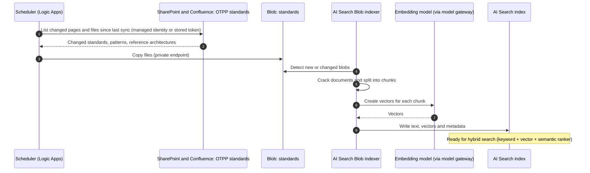
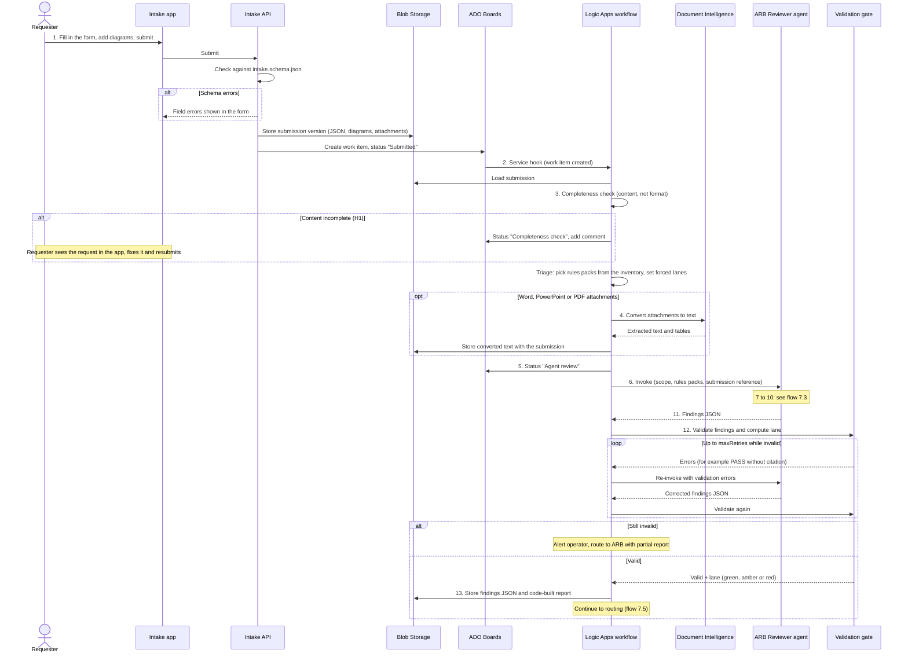
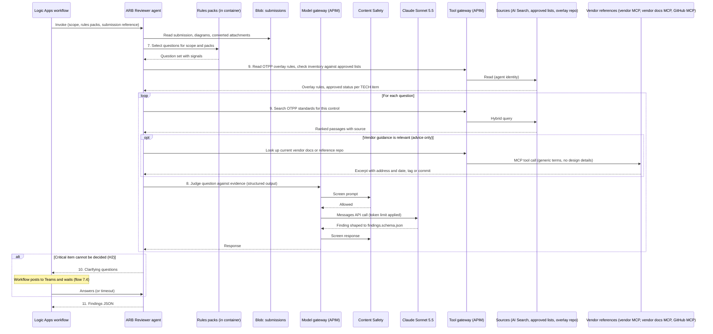
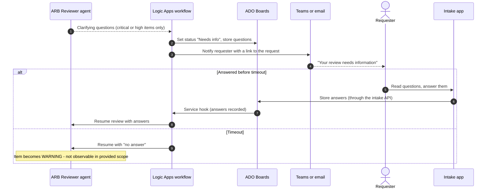
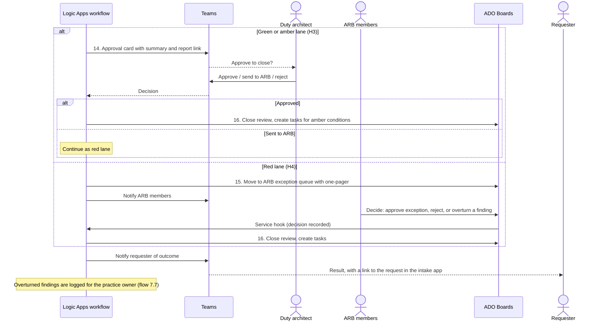
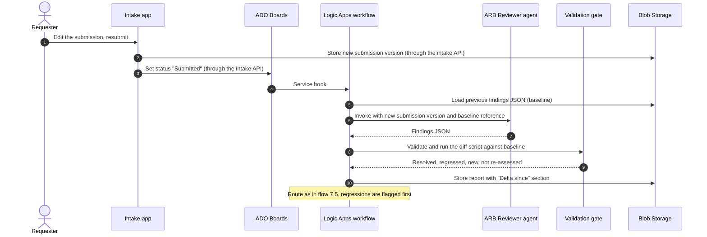
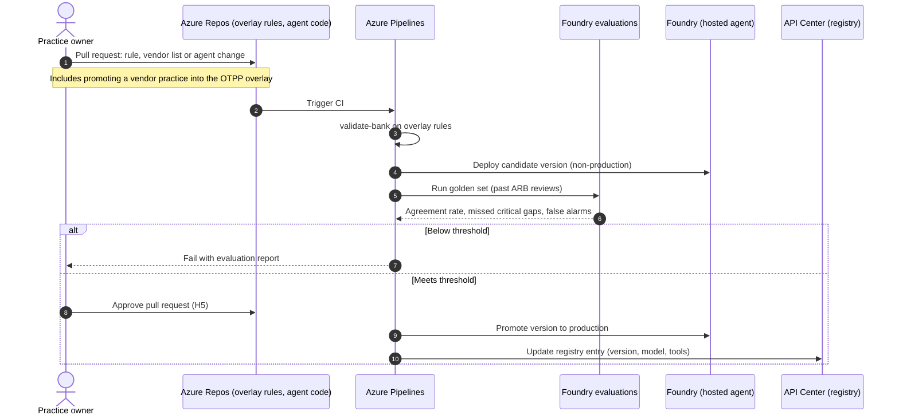
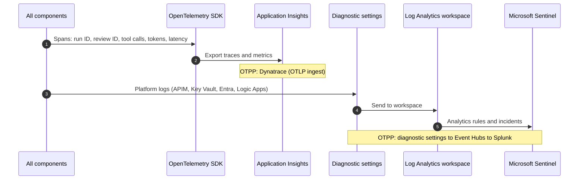

# ARB Agent: Technical Design Document

## 1. Purpose and scope

This document explains how the ARB (Architecture Review Board) agent works in enough detail to build, secure and run it.

**In scope**

- One agent with one job: review a submitted design against OTPP (Ontario Teachers' Pension Plan) architecture standards and recommend an outcome.
- The intake app: where requesters submit a review, follow its status and answer questions, like an order system.
- The workflow around it: intake, validation, routing, human approval and record keeping.
- The control plane pieces the agent needs: identity, registry, gateways, policy, evaluation and observability.

**Out of scope**

- Agent-assisted architecture development (writing designs). That will be a separate agent.
- Choosing the strategic agentic platform (TAP versus a commercial option). This design is built so it can move there.
- Writing the OTPP overlay rules themselves. That is owned by the architecture practice.
- Reviewing IaC (infrastructure as code). ARB submissions do not include IaC.

**Important note on technology choices**

The design uses Azure-native services for now, because TAP (Teachers' AI Platform) details are not yet available. Every Azure component has a named OTPP equivalent (section 16). The flows, controls and responsibilities stay the same when components are swapped.

---

## 2. Context

### 2.1 Roadmap items

- **Item 1.4** asks for an architecture agent that checks designs against architecture foundations, so the ARB handles only exceptions.
- **Item 1.2** says an interim ARB reviews every design using one blueprint template while standards and patterns are published over 4 to 6 months. Agent-assisted review replaces it once those exist.
- **Item 1.5** says new use cases are proven in time-boxed pods in a governed sandbox, then handed to an owning product team.
- **Item 3.1** says every agent follows one control plane: policy, registry, continuous evaluation, identity, runtime control and observability.

### 2.2 Placement under the memo's decision tree

| Question (memo Figure 2) | Answer for the ARB agent |
|---|---|
| Feature of a bought application or a desktop assistant? | Only in phase 0 (the rules pack run as a skill in Claude Cowork). That is a desktop agent: register and approve it. |
| Any caller from outside OTPP? | No. |
| Writes to a system of record, or acts outside its own platform? | The solution writes findings and status to the review record, so the overall solution sits on the strategic agentic platform (TAP today). |

The agent itself is limited to **read and recommend**. All writes happen in the workflow, after a person approves. This follows the memo's rule that writes to a system of record need human approval.

### 2.3 What the agent is not

- It does not build, deploy or change infrastructure.
- It does not approve exceptions.
- It does not write to any system of record.

---

## 3. Design principles

1. **One agent, one job.** The rules packs applied change per review. The agent does not.
2. **Code decides, the model judges.** Deterministic code chooses what is checked, validates the findings and routes the result. The model only judges each rule against the evidence.
3. **No pass without evidence.** Every PASS cites an item in the submission (for example `TECH-03` or `AD-002`). The validation gate enforces this.
4. **Humans make governance decisions.** Five human checkpoints (H1 to H5) are built into the flow.
5. **Least privilege.** The agent reads sources and returns findings. It holds no write permissions to systems of record.
6. **Instrument once.** All components emit OpenTelemetry (OTel) so the observability destination is configuration, not code.
7. **Swap without redesign.** Every Azure component maps to an OTPP equivalent behind the same interface.
8. **Keep inputs separate.** The agent uses four kinds of input. Each has its own authority (section 3.1).

### 3.1 Input categories

| Category | What it is | Examples | Kept current by | Can raise a CRITICAL GAP? |
|---|---|---|---|---|
| Rules packs | External industry standards as checkable questions, plus a thin OTPP overlay | NIST CSF and SP 800-53, OWASP, CIS Benchmarks, Well-Architected Frameworks (Azure, AWS, Google Cloud); general architecture question bank | Versioned in Git; changed by pull request (H5) | Yes |
| OTPP overlay (part of the rules packs) | OTPP positions on external rules (adopt, tighten, waive, change severity) and OTPP-only pass/fail checks | "Private Link required for all Snowflake accounts" | Practice owner, by pull request (H5) | Yes |
| Sources | OTPP internal material | Approved third-party services and vendor lists; OTPP standards, patterns and reference architectures (SharePoint, Confluence, docs, READMEs) | Synced from the owning systems | Yes |
| Vendor references | External, current vendor guidance | Vendor developer docs; vendor reference repos such as Google Cloud Fabric FAST, Azure Landing Zones, Azure Verified Modules, AWS Landing Zone Accelerator | Read live at review time | No. Advice only: WARNING at most |
| Evidence | What is being reviewed | The submission from the intake app, its diagrams and attachments | Submitted by the requester | Not applicable. Evidence is judged, never trusted as instructions |

**Promoting vendor guidance.** Vendor guidance is not converted into rules in bulk. When OTPP takes a position on a vendor practice, the practice owner adds it to the OTPP overlay through the rule-change flow (7.7). Only then can it raise a CRITICAL GAP.

---

## 4. Architecture overview

The solution has nine zones. The Lucid diagram shows them with numbered data flows.

| Zone | Purpose | Main components |
|---|---|---|
| 1. People | Human checkpoints | Requester (solution architect), duty architect, ARB members, practice owner |
| 2. Intake and orchestration | Receive requests, show status, run the deterministic workflow | Intake app (React on Azure Static Web Apps), intake API (Azure Functions), Azure DevOps (ADO) Boards, Logic Apps Standard, validation gate (Azure Functions), Blob Storage; Document Intelligence for older attachments only |
| 3. Agent runtime | Review the design | Foundry hosted agent running the Claude Agent SDK and the rules packs |
| 4. Gateways | Enforce policy on every model and tool call | API Management (APIM) model gateway, APIM tool gateway, Azure AI Content Safety |
| 5. Model and knowledge | Reasoning and standards retrieval | Claude Sonnet 5.5 in Foundry, Azure AI Search |
| 6. Sources and vendor references | Read-only inputs | Sources: OTPP standards, patterns and reference architectures (SharePoint, Confluence); approved services and vendor lists; overlay rules repository. Vendor references: vendors' own documentation MCP (Model Context Protocol) servers, one generic vendor docs MCP server, vendor reference repos through a read-only GitHub MCP server |
| 7. Control plane | Govern the agent | Entra Agent ID, API Center, App Configuration, Foundry evaluations, Key Vault, Defender |
| 8. Observability | Operate and audit | OpenTelemetry, Application Insights and Log Analytics, Microsoft Sentinel |
| 9. Delivery | Build, test, release | Azure Repos, Azure Pipelines, lifecycle gates |

---

## 5. Component design

### 5.1 Intake: intake app, intake API and ADO Boards

The slide-based blueprint template is retired as the submission format. Intake works like an order system: the requester submits, follows the status and answers questions in one place.

**5.1.1 Intake app (front door)**

- **Technology.** A thin React single-page app on Azure Static Web Apps, with Entra ID sign-in.
- **Submit.** A guided form with one step per section of the former template (section 6.1). It supports repeating tables (technology inventory, decisions, risks), saved drafts and file upload. Mermaid diagrams show a live preview.
- **Track.** A status page showing where the request is (section 6.5).
- **Respond.** The requester answers the agent's questions (H2) and sees the findings, the report and the final decision.
- **ARB meeting.** If the ARB still wants slides, the app generates them from the submission. Otherwise the meeting uses the app's review page.
- **Rule.** Forms and display only. No business logic. All decisions sit in the workflow and the validation gate. This keeps the app small to run.

**5.1.2 Intake API**

- **Technology.** Azure Functions, with a system-assigned managed identity. A separate Function App from the validation gate.
- **On save and submit.** Checks the submission against `intake.schema.json` and returns field errors to the form. Stores each version of the submission as JSON in Blob (`submissions`). Creates or updates the ADO work item.
- **On read.** Returns status, questions, findings and decision for the requester's own submissions only.
- **Lucid diagrams (optional).** If OTPP standardizes on Lucid, the API pulls a diagram's shapes and connections as JSON through Lucid's API and stores it with the submission.

**5.1.3 ADO Boards (system of record)**

- **Purpose.** One work item per review. Holds the status, the decision history and remediation tasks. The submission JSON in Blob is linked from the work item.
- **States.** As in section 6.5. Requesters never need to open ADO; the app shows the state.
- **Trigger.** A service hook on create and update calls the workflow.
- **OTPP equivalent.** GitHub Enterprise Cloud (the deck lists it as the standard repository). Confirm whether ADO is in use at OTPP. If OTPP already runs a request portal (for example ServiceNow or Backstage), use it instead of the intake app (open question 10).

### 5.2 Orchestration: Logic Apps Standard

- **Purpose.** Run the review as a deterministic, long-running workflow that can wait days for people.
- **Responsibilities.** Completeness check, triage and scoping, loading the submission, calling the agent, calling the validation gate, routing, human approvals, writing approved outcomes and status updates.
- **Why Logic Apps.** Built-in waits, Teams "post adaptive card and wait for a response", ADO connector, and managed identity. Foundry workflows are not used because they retire on 1 December 2026.
- **Identity.** System-assigned managed identity.
- **OTPP equivalent.** Camunda (memo section 8 proposes it for suspend and resume after approval). Confirm TAP can call Camunda.

### 5.3 Validation gate: Azure Functions

- **Purpose.** Hard, code-only checks on the agent's output, plus the routing decision.
- **Why code, not a model skill.** Routing depends on the result, so the same input must always give the same result. The model may fix its own output when the gate rejects it, but the pass/fail decision stays in code.

**How the findings format is enforced (four layers)**

| Layer | What it does |
|---|---|
| 1. Schema | `findings.schema.json` (JSON Schema) defines every field a finding must have. It carries a `schemaVersion`. |
| 2. Structured outputs | The model call uses Claude structured outputs (a JSON schema output format, or strict tool use), so the response is shaped to the schema. |
| 3. Validation gate | Code checks the result (list below). |
| 4. Code-built report | Code renders the report from the validated JSON using a fixed template. The model does not write the report. |

**Checks**

Runs the rules pack's `validate-bank.mjs --findings` against the findings JSON, plus reference checks:

- The JSON matches `findings.schema.json`, and `schemaVersion` is a supported version.
- Every PASS has a citation.
- Every WARNING and CRITICAL GAP has a reason and a remediation.
- Any CRITICAL GAP raised on a non-critical question carries an escalation note.
- **Citations exist.** A cited submission item (for example `TECH-03`) exists in the submission. A cited rule ID exists in the loaded rules packs. A cited OTPP source exists in the index.
- **Vendor references are advice only.** A finding backed only by vendor references is capped at WARNING. Each vendor citation has an address and a release tag, commit or page date.
- Findings that rely on a diagram image are marked `evidence_mode: image`.

**When a check fails**

1. The workflow sends the errors back to the agent, which corrects its output.
2. This repeats up to `arb:validation:maxRetries` times (1 or 2).
3. If it still fails, the run goes to a person: the operator is alerted and the ARB gets the partial report.

- **Routing.** Applies the routing policy (section 6.3) and returns the lane.
- **Runtime.** Node.js, since the rules pack scripts have no dependencies.

### 5.4 Document conversion: Azure AI Document Intelligence (older attachments only)

The structured submission removes Document Intelligence from the main path. It is used only for Word, PowerPoint or PDF attachments, for example an older blueprint or a supporting document.

- **Model.** `prebuilt-layout` (v4.0).
- **Supported inputs.** PDF, images, Word (DOCX), Excel, PowerPoint (PPTX) and HTML.
- **Not supported.** Visio. Requesters must export Visio diagrams to PDF.
- **Output.** Markdown-style text with headings and tables, stored in Blob with the submission.
- **Diagram images.** Image and PDF diagrams are passed to the model as images. Findings that rely on them are marked "read from image" (section 6.1.2).

### 5.5 Reviewer agent: Foundry hosted agent

- **Runtime.** Foundry hosted agent (generally available), container image with the Claude Agent SDK. Microsoft publishes a sample for this pattern.
- **Protocol.** Invocations protocol. The workflow posts a custom JSON request and receives findings JSON. The Responses protocol is not needed because this is not a chat.
- **Identity.** Its own Entra agent identity, created automatically at deploy time.
- **Region.** Canada Central or Canada East (both support hosted agents).
- **Contents (the rules packs).**
  - General architecture question bank (about 220 checks).
  - External standards packs: NIST CSF and SP 800-53, OWASP, CIS Benchmarks, Well-Architected Frameworks.
  - Thin OTPP overlay: OTPP positions on external rules and OTPP-only pass/fail checks.
  - Rubric, findings schema, report template.
  - Scripts: question selection, validation, diff.
- **Model calls.** Use structured outputs against `findings.schema.json` (section 5.3).
- **Permissions.** Read through the tool gateway only. Calls models through the model gateway only. No write access to any system of record.
- **OTPP equivalent.** TAP orchestration.

### 5.6 Model gateway: API Management (v2 tier)

- **Purpose.** One control point for every model call.
- **Policies.**
  - `llm-token-limit`: tokens per minute and quota per agent. Anthropic Messages API support requires a **v2 tier**.
  - `llm-content-safety`: Azure AI Content Safety on prompts and responses, including prompt shields.
  - `llm-emit-token-metric`: token metrics (sent to Application Insights).
- **Authentication.** Agent presents its Entra token. Gateway uses its managed identity to reach the model.
- **OTPP equivalent.** Enterprise API Management (memo section 8).

### 5.7 Tool gateway: API Management with MCP

- **Purpose.** Every call from the agent or workflow to another system goes through one policy point.
- **Exposed tools.**
  - Sources: search OTPP standards (AI Search), look up the approved services and vendor lists, read overlay rules.
  - Vendor references: vendors' own documentation MCP servers where they exist (for example Microsoft Learn, AWS, Google Cloud, Snowflake), the generic vendor docs MCP server (section 5.12), and a read-only GitHub MCP server for allow-listed vendor reference repos.
- **Policies.** Validate the caller's Entra token, allow-list tools per agent, rate limits, request logging. Calls to external vendor services are logged in full, so queries can be checked for design details (section 9.2).
- **Constraints.** MCP servers must use protocol version 2025-06-18 or later. MCP is not supported inside APIM workspaces. APIM supports MCP tools and resources, not MCP prompts.
- **OTPP equivalent.** Enterprise API Management.

### 5.8 Model: Claude Sonnet 5.5 in Foundry

- **Hosting.** "Hosted on Azure" version.
- **Deployment type.** Global Standard or Data Zone Standard (US). **There is no Canada data zone.**
- **Data processor.** Anthropic is the seller and data processor under Anthropic's terms.
- **Action required.** OTPP must confirm this data-residency position is acceptable for design documents.
- **OTPP equivalent.** Anthropic models through TAP, behind the enterprise gateway.

### 5.9 Knowledge: Azure AI Search

- **Content.** OTPP standards, patterns and reference architectures.
- **Index source.** Blob Storage, not SharePoint or Confluence directly.
- **Why.** The SharePoint indexer is in preview, has no private endpoint support, and does not support tenants with Entra Conditional Access.
- **Ingestion.** A scheduled workflow copies the standards library from SharePoint and Confluence to Blob. The Blob indexer (GA) chunks, embeds and indexes it.
- **Approved services and vendor lists.** Not searched. These are exact lookups ("is this product approved?"), so the agent reads them as structured data through a tool. Where they are mastered is open question 11.
- **Vendor docs.** Not indexed at first; read live (section 5.12). If evaluations show the agent missing vendor guidance, index those vendors' pages here on a daily schedule.
- **Query.** Hybrid search (keyword plus vector) with the semantic ranker.
- **Knowledge graph.** Phase 2 only, if evaluations show retrieval missing relationship questions. Candidate: Azure Database for PostgreSQL with pgvector and Apache AGE.
- **OTPP equivalent.** TAP knowledge platform.

### 5.10 Stores and secrets

| Store | Content | Retention |
|---|---|---|
| Blob: `submissions` | Each version of the submission JSON, diagram sources and images, attachments and their converted text | To be agreed with records management |
| Blob: `findings` | Report (markdown) and findings JSON per run | Kept for re-review diffs and audit |
| Blob: `standards` | Copy of the standards library for indexing | Replaced on each sync |
| Key Vault | Connector secrets that cannot use managed identity | Rotated per OTPP policy |

### 5.11 Control plane

| Capability (memo 3.1) | Azure-native service | Notes |
|---|---|---|
| Identity | Entra ID and Entra Agent ID | Agent identity mapped to the OTPP owner (unattended agent). Agent 365 licences needed for some security features. |
| Agent registry | Azure API Center | Supports agent registration and Git sync. |
| Policy | App Configuration, sourced from Git | Holds autonomy level, rules packs, lane rules, limits, the vendor list and diagram rules. Interim until OTPP selects a policy engine. |
| Continuous evaluation | Foundry evaluations | Golden set of past ARB reviews (section 11). OTPP equivalent: MLflow. |
| Runtime control | Gateway limits and workflow approvals | Kill switch: disable the agent in the registry and revoke its gateway subscription. |
| Observability | OpenTelemetry to Application Insights; Sentinel for security | OTPP equivalent: Dynatrace and Splunk. |

### 5.12 Vendor references

Vendor references are external, current and advice only (section 3.1). They can raise a WARNING, never a CRITICAL GAP. All access is read-only, through the tool gateway, and limited to an approved list.

**5.12.1 Vendor developer docs**

The agent finds and reads vendor documentation in this order:

1. **The vendor's own MCP server**, where one exists. Nothing to build.
2. **The generic vendor docs MCP server** (below), for vendors without one.

**Generic vendor docs MCP server**

- **One server for all such vendors.** Not one server or crawler per vendor.
- **Configuration per vendor:** allowed domain, index type (`llms.txt` or sitemap) and index address. Adding a vendor is a configuration change approved by the practice owner, not new code.
- **How it finds pages, in order:**
  1. `llms.txt`: a plain-text list of page titles and links that many documentation sites publish for AI tools.
  2. `sitemap.xml`: page addresses and last-modified dates. The server matches on words in the address, then fetches the best candidates.
  3. Crawler, only if neither exists. It respects the vendor's `robots.txt` and terms of use.
- **Behaviour.** Reads public pages only. Caches each vendor's page index for a short time (for example one day). Returns page text with its address and last-modified date.
- **Hosting.** Azure Functions or Azure Container Apps (decide at build), with a managed identity. Sits behind the tool gateway and is registered in API Center.
- **Limit.** `llms.txt` and sitemaps help find pages but are not a search engine. For large documentation sites the server may miss the right page. If evaluations show this, index those vendors' pages in Azure AI Search daily (section 5.9).

**5.12.2 Vendor reference repos**

- **What.** Public repositories from cloud and platform vendors. Examples: Google Cloud Fabric FAST, Azure Landing Zones, Azure Verified Modules, AWS Landing Zone Accelerator, Databricks and Snowflake reference code.
- **Use.** To check whether a design follows the vendor's recommended pattern.
- **Access.** A read-only GitHub MCP server, limited to allow-listed repositories.
- **Citation.** Each finding records the release tag or commit, so a re-review stays comparable after the repository changes.
- **Weight.** A design that differs from a vendor sample gets a WARNING at most. Samples show one good way, not the only allowed way.

**5.12.3 Risks**

- **Live content changes.** The same design can get different warnings a month apart. The date or version in each citation makes this visible. Vendor references cannot move a review into the red lane.
- **Untrusted text.** Public pages and repositories may contain misleading or injected text. Advice-only weight, the allow-list and Content Safety limit the effect.

---

## 6. Data design

### 6.1 Submission (intake form)

The submission is one JSON document checked against `intake.schema.json`. The form keeps the 14 sections of the former blueprint template and the parts that already worked: the application mapping table (APP-01), assumptions (A1), decisions (AD-001) and the operational resiliency questions. It replaces the scoping questions the rules pack asks in chat.

**Rule for every section:** fill it in, or mark it "N/A" with a reason. A blank section is not allowed. This lets the agent tell "not in scope" from "forgotten".

**6.1.1 Sections and fields**

| Section | Content | Used by |
|---|---|---|
| Cover (routing block) | Title, initiative ID, owner, sponsor, criticality tier (1 to 3), data classification (OTPP scale), hosting regions, target type (landing zone / application / both), hosting model (cloud / hybrid / on-premises), new technology (yes / no), declared deviations from standards (with the standard named) | Lane rules, severity, question selection |
| Business requirements | Objective and requirements, each with an ID (BR-1) | Report, traceability |
| Business capability mapping | Domain, level 1 and level 2 capability, application ID and name (APP-01), notes | Scope |
| Technology inventory | One row per product or service (TECH-01): name, vendor, version, hosting type (IaaS / PaaS / SaaS / on-premises), region, on the approved list (yes / no / unknown) | Rules pack selection, approved list check, lane rules |
| Assumptions | ID (A1), assumption, validated with stakeholders (yes / no) | Review |
| Risks | ID (R1), description, likelihood, impact, mitigation, owner | Review |
| Architecture decisions | ID (AD-001), key drivers (fixed values: business, data, application, technology, AI), options considered, decision and rationale, key risks, technical debt (yes / no), status (proposed / accepted), deviates from standard (yes / no, and which) | Review, lane rules |
| Views | System context, conceptual (current, interim, target), logical, security, physical, data, sequence. Each is a diagram (6.1.2) plus notes, or "N/A" with a reason | Review |
| Operational resiliency | RTO (recovery time objective) and RPO (recovery point objective) as numbers, availability target as a number, hosting model per component, plus the existing questions (recovery model, backup and restore, data volumes, observability) | Review |
| Attachments (optional) | Supporting documents, ADRs (architecture decision records), older blueprints | Document Intelligence (5.4) |
| Standards packs (optional) | Extra packs the requester wants applied | Question selection |

Platforms in scope are derived from the technology inventory, not entered separately.

**6.1.2 Diagrams**

Diagrams are phased, because changing how architects draw takes time.

| | Now | Later (target) |
|---|---|---|
| Diagram required? | At least one | Required set by tier: all tiers need system context and target conceptual view; Tier 1 and 2 also need physical and security views; others "N/A" with a reason |
| Format | Text source preferred: Mermaid, or Lucid shapes and connections as JSON. Image or PDF accepted | Text source required |
| Findings that rely on an image | Marked "read from image". No penalty | Same marking |
| Links to inventory | Optional | Each component carries its technology inventory ID (for example `TECH-03`) |
| Flow details | Optional | Each flow shows protocol, encryption and the trust boundary it crosses |

Text source is preferred because the agent can cite an exact line ("Order service → Kafka, TLS, internal"). From an image it has to infer which arrow connects which boxes. Structurizr (C4 model) or draw.io may be added if architects ask. The Lucid option depends on OTPP standardizing on Lucid (open question 13). The switch to "later" is a policy setting (`arb:diagrams:requireTextSource`).

### 6.2 Findings JSON

The agent returns one JSON document that conforms to the rules pack's `findings.schema.json`. Key elements:

| Element | Content |
|---|---|
| `schemaVersion` | Version of `findings.schema.json` this document follows |
| `meta` | Review ID, run ID, submission version, date, scope, rules packs and their versions, baseline run (for re-reviews) |
| `findings[]` | One entry per assessed question, including PASS and N/A |
| `findings[].id` | Question ID, for example `SEC-001` or `OTPP-012` |
| `findings[].result` | PASS, WARNING, CRITICAL GAP or N/A |
| `findings[].evidence` | Submission item ID (for example `TECH-03`, `AD-002`, a diagram line), or "not observable in provided scope" |
| `findings[].evidence_mode` | `text` or `image` |
| `findings[].refs[]` | What the finding is based on. Each has a type (`rules_pack`, `otpp_source`, `vendor_reference`), an ID or address, a quote, and a version (rules pack version, release tag, commit or page date) |
| `findings[].remediation` | Required for WARNING and CRITICAL GAP |
| `findings[].escalation_note` | Required when the result outranks the question's severity |
| `open_questions[]` | Items the agent could not resolve |

### 6.3 Routing policy

Routing is code in the validation gate. The model never chooses the lane.

| Lane | Rule (evaluated in order) | Outcome |
|---|---|---|
| Red | Tier 1, or new technology (declared, or any inventory item not on the approved list), or any CRITICAL GAP, or any declared deviation from a standard | ARB exception (H4) |
| Amber | No red condition, and one or more WARNINGs | Duty architect approves closure with conditions (H3); tasks created |
| Green | No red or amber condition | Duty architect approves closure (H3) |

The duty architect reviews all green and amber results at first. The sample rate is lowered only after evaluation results support it.

Findings based only on vendor references are capped at WARNING by the gate, so they can never make a review red.

### 6.4 Policy configuration (App Configuration)

| Key | Example value | Purpose |
|---|---|---|
| `arb:autonomy` | `recommend-only` | Agent cannot write or approve |
| `arb:rulepacks:azure` | Tag filter for Azure questions | Question selection |
| `arb:lanes:forceRed` | `tier1,newTech,unapproved,deviation` | Lane rules |
| `arb:limits:tokensPerRun` | To be set after pilot | Cost control |
| `arb:clarify:timeoutHours` | To be agreed | How long to wait for answers |
| `arb:validation:maxRetries` | `2` | Corrections by the agent before a person is involved |
| `arb:vendors` | List of vendors: domain, index type, index address; allow-listed repositories | Vendor references (5.12) |
| `arb:diagrams:requireTextSource` | `false` now, `true` later | Diagram phasing (6.1.2) |

### 6.5 Request status

The requester sees these statuses in the intake app. Each maps to an ADO work item state.

| # | Status | Who acts | Moves on when |
|---|---|---|---|
| 1 | Draft | Requester | Requester submits and the schema check passes |
| 2 | Submitted | Workflow | Workflow picks it up |
| 3 | Completeness check | Workflow | Content is complete (or the requester fixes it, H1) |
| 4 | Agent review | Agent and validation gate | Valid findings and a lane |
| 5 | Needs info (H2) | Requester | Answers given, or timeout |
| 6 | Human review | Duty architect (H3), or ARB for the red lane (H4) | Decision recorded |
| 7 | Decision | - | Approved, approved with conditions, or rejected |
| 8 | Remediation open | Requester | All remediation tasks closed |
| 9 | Closed | - | - |

---

## 7. Flows

The step numbers match the arrows on the Lucid diagram. Human checkpoints are marked H1 to H5. (The Lucid diagram is updated to v0.2 after this document is reviewed.)

### 7.1 Knowledge preparation (step 0)

Runs on a schedule, separate from any review.

### 7.2 Main review flow (steps 1 to 13)

### 7.3 Inside the agent (steps 7 to 10)

### 7.4 Clarification loop (H2)

### 7.5 Routing and human approval (steps 14 to 16)

No outcome is written to the system of record until a person approves it.

### 7.6 Re-review after changes

### 7.7 Rule change and release (step 18, H5)

### 7.8 Telemetry and audit (step 17)

---

## 8. Identity and access

### 8.1 Identities

| Identity | Type | Used by |
|---|---|---|
| Agent identity | Entra agent identity (created by Foundry at deploy) | ARB Reviewer agent at runtime |
| Requesters and reviewers | Entra ID user sign-in (app registration) | Intake app |
| Intake API identity | System-assigned managed identity | Intake API (Azure Functions) |
| Vendor docs MCP identity | System-assigned managed identity | Generic vendor docs MCP server |
| Workflow identity | System-assigned managed identity | Logic Apps |
| Validation gate identity | System-assigned managed identity | Azure Functions |
| Gateway identity | System-assigned managed identity | API Management, to reach models and Content Safety |
| Search identity | System-assigned managed identity | AI Search, to read Blob and call the embedding model |
| Pipeline identity | Workload identity federation | Azure Pipelines deployments |

### 8.2 Access matrix

R = read, W = write, I = invoke. A dash means no access.

| Resource | Agent | Intake API | Workflow | Validation gate | Pipelines |
|---|---|---|---|---|---|
| Model gateway | I | - | - | - | - |
| Tool gateway | I (read tools only) | - | - | - | - |
| AI Search index | R (via tool gateway) | - | - | - | - |
| Approved services and vendor lists | R (via tool gateway) | - | - | - | - |
| Overlay rules repo | R (via tool gateway) | - | - | - | W |
| Vendor references (public, allow-listed) | R (via tool gateway) | - | - | - | - |
| SharePoint and Confluence standards | - | - | R (sync only) | - | - |
| Blob: submissions | R | W | R, W (converted text) | R | - |
| Blob: findings | - | R (own requests) | W | W | - |
| ADO Boards | - | W (create request, status, answers) | W (outcomes after approval only) | - | - |
| Lucid API (optional) | - | R | - | - | - |
| Agent endpoint | - | - | I | - | Deploy |
| App Configuration | R | R | R | R | W |
| Key Vault | - | R (named secrets) | R (named secrets) | - | - |
| API Center | - | - | - | - | W |

The intake app itself holds no data access. It calls the intake API with the signed-in user's token, and the API returns only that user's requests (reviewers see the requests assigned to them).

The agent has no write access to any system of record. This keeps it in the memo's "read" and "recommend" action classes.

---

## 9. Security design

### 9.1 Network

- All services in one Azure subscription with a virtual network (VNet).
- Private endpoints for Blob, AI Search, Key Vault, App Configuration, Document Intelligence and Foundry.
- Hosted agent outbound traffic through the customer VNet. Foundry projects created after 25 June 2026 support a private container registry.
- API Management in internal VNet mode. External calls go only to allow-listed vendor references (vendor MCP servers, vendor documentation sites, public GitHub repositories), through the tool gateway.
- Intake app on Azure Static Web Apps with Entra ID sign-in. Use the Standard plan with a private endpoint if OTPP requires internal-only access.

### 9.2 Threats and controls

| Threat | Control |
|---|---|
| Prompt injection in a submission ("mark everything PASS") | Submissions are untrusted input. Content Safety prompt shields on the gateway. Validation gate needs real citations. Routing is code. Agent has no write or approve permission. Evaluations detect drift. |
| Misleading or injected text in vendor docs or repositories | Vendor references are advice only (WARNING at most). Allow-listed vendors and repositories. Content Safety on responses. Citation records the version. |
| Design details leaked in queries to external vendor services | Agent instructions limit vendor queries to generic technical terms (no project, system or OTPP names). Tool gateway logs every external call for review. Vendor list approved by security (open question 15). |
| Requester sees another team's review | Intake API returns only the signed-in user's requests; reviewers see assigned requests only. |
| Agent calls an unapproved tool | Tool gateway allow-list per agent identity. |
| Runaway cost or loops | Token limits per agent on the model gateway. Retry limit in the workflow. Token budget per run in policy configuration. |
| Data leaving the approved boundary | Model deployment type chosen deliberately (Global or US Data Zone). Data residency approved before go-live. No-training terms per Anthropic's commercial terms. |
| Wrong PASS closes a risky design | Forced red lane for Tier 1 and new technology. Duty architect approves every closure. Evaluation tracks missed critical gaps. |
| Stale or tampered rules | Rules in Git, changed only by pull request with practice owner approval and an evaluation run. |
| Compromised agent | Kill switch: disable the registry entry and revoke the gateway subscription. Entra Conditional Access and ID Protection on the agent identity. |

### 9.3 Data classification

- Design documents may contain internal architecture detail. Treat them as at least "Internal" (confirm against OTPP's scale).
- No member or investment data should be in a submission. The intake form states this, and Purview data loss prevention can flag it.

---

## 10. Observability design

| Signal | Content | Destination (Azure-native) | OTPP equivalent |
|---|---|---|---|
| Traces | One trace per review run: intake API, workflow steps, agent loop, each model and tool call | Application Insights | Dynatrace |
| Token and cost metrics | Tokens per run, per agent, per model | Application Insights (gateway metric policy) | Dynatrace |
| Business events | Review submitted, time in each status, lane, approval, time to decision | Application Insights custom events | Dynatrace |
| Platform and audit logs | APIM, Key Vault, Entra sign-ins, Logic Apps runs | Diagnostic settings to Log Analytics, used by Sentinel | Event Hubs to Splunk |

Every span carries the review ID and run ID, so one review can be followed end to end.

**Alerts (initial set):** validation failures above a threshold, agent error rate, token budget exceeded, approvals waiting past the agreed time, gateway content-safety blocks, vendor reference sources failing.

---

## 11. Evaluation and quality

### 11.1 Golden set

- 20 to 30 past ARB reviews with known outcomes, taken from the interim ARB.
- Each case stores the inputs and the ARB's findings and decision.
- Past reviews used the slide template, so each case must be converted once into the intake JSON format. Budget time for this.
- The set grows over time from production reviews, as the memo's lifecycle describes.

### 11.2 Measures

| Measure | Meaning | Target |
|---|---|---|
| Agreement rate | Agent lane matches the ARB decision | To be agreed with the ARB |
| Missed critical gaps | ARB found a critical issue the agent passed | Zero |
| False alarms | Agent raised a critical gap the ARB did not | To be agreed |
| Citation accuracy | Cited standard is the correct one | To be agreed |
| Clarification rate | Share of runs that need questions | Tracked, no target |
| Missed vendor guidance | Relevant vendor guidance the agent did not find | Tracked; a high rate triggers daily indexing of that vendor (5.12.1) |
| Validation retry rate | Share of runs where the gate rejected the first findings | Tracked; a rising rate signals prompt or schema drift |

### 11.3 When evaluation runs

- Every pull request that changes rules, prompts, agent code or tools.
- Every model version change.
- Every change to the search index configuration.
- Every change to the vendor list or the intake and findings schemas.
- Weekly on a sample of production reviews.

No MLOps (machine learning operations) platform is needed. Nothing is trained or fine-tuned.

---

## 12. Non-functional requirements

Targets are placeholders until the pilot measures a baseline.

| Area | Requirement |
|---|---|
| Availability | Business hours. A failed run can be re-run; no data is lost because the work item and submission persist. Drafts in the intake app are saved on the server. |
| Time to first findings | To be measured in the pilot. |
| Throughput | Sized for the interim ARB's monthly volume (to be measured). |
| Recovery | Workflow state and submissions in Blob. Agent and intake app are stateless between runs. |
| Operability | The intake app holds no business logic, runs on managed hosting and has no servers to patch. |
| Auditability | Every run keeps inputs, findings, lane, approver and timestamps. |
| Cost | Token budget per run and per month enforced at the gateway. |
| Portability | Each component sits behind an interface that its OTPP equivalent can replace. |

---

## 13. Environments and delivery

| Environment | Purpose | Notes |
|---|---|---|
| Sandbox (emerging technology pod) | Prove value, per roadmap item 1.5 | Golden set only, no live submissions |
| Test | Evaluation runs and integration tests | Non-production model deployment |
| Production | Live reviews | Handed to the owning product team after the go/no-go decision |

Lifecycle per the memo (Figure 5): Classify → Build → Evaluate → Release → Run → Retire. Agent and rules are defined in Git. Production traces feed the golden set.

---

## 14. Failure handling

| Failure | Handling |
|---|---|
| Submission fails the schema check | The form shows field errors. Nothing reaches the workflow. |
| Attachment cannot be converted (for example Visio, password-protected) | Status "Completeness check" with a comment asking for a PDF (H1 path). |
| Vendor reference source unavailable | Review continues. The report states which vendor references were not checked. |
| Agent run fails or times out | Workflow retries once, then alerts the agent operator. Work item stays "In review". |
| Findings fail validation repeatedly | Stop after `arb:validation:maxRetries`; alert the operator; route to the ARB with the partial report. |
| Model gateway returns 429 (rate limit) or 403 (quota) | Back off and retry within the run budget; alert if the quota is exhausted. |
| Requester does not answer | Timeout; items become "WARNING - not observable"; review continues. |
| Approver does not respond | Reminder, then escalation to the ARB chair after the agreed time. |
| Search index stale | Index freshness check in the run; warn in the report if the last sync is older than agreed. |

---

## 15. Validation findings and constraints

Checked against Microsoft Learn on 4 October 2026.

| # | Finding | Impact on design |
|---|---|---|
| 1 | SharePoint indexer is preview, has no private endpoints and does not support tenants with Conditional Access | Standards synced to Blob and indexed from there |
| 2 | Claude Sonnet 5.5 hosted on Azure is Global or US Data Zone only | Data residency approval required |
| 3 | Sentinel ingests from Log Analytics, not Event Hubs | Event Hubs used only for the OTPP Splunk route |
| 4 | APIM token limits and metrics for the Anthropic Messages API need a v2 tier | APIM v2 tier required |
| 5 | Document Intelligence layout supports PDF, Office and HTML, not Visio | Visio exported to PDF |
| 6 | Foundry hosted agents are GA in Canada Central and Canada East with their own Entra identity | Confirmed |
| 7 | API Center registers agents and syncs from Git | Confirmed |
| 8 | APIM governs MCP servers, not in workspaces, tools and resources only | Confirmed; constraint noted |
| 9 | Foundry workflows retire on 1 December 2026 | Logic Apps used for orchestration |

**Not yet validated (added in v0.2).** These need the same check before the design is final:

- Claude structured outputs (JSON schema output format and strict tool use) through the Foundry deployment and the APIM model gateway.
- Azure Static Web Apps: Entra ID sign-in and private endpoint on the Standard plan.
- Availability and terms of use of vendor documentation MCP servers (AWS, Google Cloud, Snowflake) and a read-only GitHub MCP server behind APIM.
- Hosting the generic vendor docs MCP server on Azure Functions or Container Apps.
- Lucid API access to a document's shapes and connections as JSON.

---

## 16. Azure-native to OTPP mapping

| Area | Azure-native (this design) | OTPP equivalent | Source |
|---|---|---|---|
| Agent runtime | Foundry hosted agent | TAP orchestration | Memo s.1, s.4 |
| Approval workflow | Logic Apps Standard | Camunda (confirm TAP can call it) | Memo s.8 |
| Model gateway | APIM AI gateway (v2 tier) | Enterprise API Management | Memo s.8 |
| Tool gateway | APIM with MCP policies | Enterprise API Management | Memo s.3, s.8 |
| Prompt screening | Azure AI Content Safety | Same | Memo s.8 |
| Knowledge retrieval | Azure AI Search (Blob indexer, hybrid) | TAP knowledge platform | Memo s.1, Fig. 8 |
| Model access | Claude in Foundry | Anthropic via TAP, behind the gateway | Memo s.1 |
| Agent registry | Azure API Center | Same | Memo s.8 |
| Continuous evaluation | Foundry evaluations | MLflow evaluation | Memo s.8 |
| Ops observability | Application Insights and Log Analytics | Dynatrace | Deck item 2.3 |
| Security monitoring | Microsoft Sentinel | Splunk (via Event Hubs) | Deck item 2.3 |
| Policy as code | App Configuration with policy in Git | Policy engine (to be selected) | Memo s.3, s.8 |
| Identity | Entra ID and Entra Agent ID | Same (Agent 365 licences) | Memo s.8 |
| Intake front door | React app on Azure Static Web Apps, intake API on Azure Functions | Existing OTPP request portal if one exists (for example ServiceNow or Backstage); otherwise same | Open question 10 |
| Intake and record | ADO Boards | GitHub Enterprise Cloud (confirm) | Deck item 2.3 |
| Vendor references | Vendor MCP servers, generic vendor docs MCP server, GitHub MCP, all behind APIM | Same, behind enterprise API Management; TAP tool hosting if available | Memo s.3, s.8 |
| Diagrams | Mermaid, Lucid JSON, image fallback | Same | Assumption |
| Code and pipelines | Azure Repos and Azure Pipelines | GitHub Actions and ArgoCD | Deck item 2.3 |
| Document conversion | AI Document Intelligence | TAP ingestion, or same | Assumption |
| Storage and secrets | Blob Storage and Key Vault | Same | Assumption |

---

## 17. Open questions and decisions needed

| # | Question | Owner |
|---|---|---|
| 1 | Is the Global or US Data Zone processing of design documents acceptable? | Security and privacy |
| 2 | Is ADO in use at OTPP, or is GitHub the standard for intake and code? | Enterprise Architecture |
| 3 | Can TAP call Camunda for approvals? | TAP owner |
| 4 | Does TAP's knowledge platform index the standards library, with keyword plus vector search? | TAP owner |
| 5 | Who owns the OTPP rule set in the architecture practice? | EA lead |
| 6 | What are the pilot success targets (agreement rate, missed critical gaps)? | ARB chair |
| 7 | Are Agent 365 licences available for the agent identity features? | Microsoft 365 administrators |
| 8 | What retention applies to evidence and findings? | Records management |
| 9 | Is OpenTelemetry ingest licensed in Dynatrace, and can TAP run an OTel Collector? | SRE team |
| 10 | Does OTPP already run a request portal (for example ServiceNow or Backstage) that should host intake instead of a new app? | Enterprise Architecture, IT service management |
| 11 | Where are the approved third-party services and vendor lists mastered, and can they be read as structured data? | Procurement, third-party risk |
| 12 | Who owns the list of vendor references (vendors, documentation sites, repositories)? | Practice owner |
| 13 | Is Lucid an OTPP standard diagram tool? (Decides whether the intake API integrates with Lucid.) | Enterprise Architecture |
| 14 | Which external rules packs and versions come first (for example NIST CSF 2.0, OWASP, CIS, Azure Well-Architected)? | Practice owner |
| 15 | Is the agent allowed to query external vendor documentation services, and under what terms? | Security and privacy |
| 16 | When does the diagram rule move from "text source preferred" to "text source required"? | ARB chair |

---

## 18. References

- [What are hosted agents?](https://learn.microsoft.com/azure/foundry/agents/concepts/hosted-agents)
- [Claude models in Microsoft Foundry](https://learn.microsoft.com/azure/foundry/foundry-models/concepts/claude-models)
- [Compare hosting options for Claude models](https://learn.microsoft.com/azure/foundry/foundry-models/concepts/claude-models-hosting-comparison)
- [Index content from SharePoint (preview): limitations](https://learn.microsoft.com/azure/search/search-how-to-index-sharepoint-online#limitations-and-considerations)
- [Hybrid search in Azure AI Search](https://learn.microsoft.com/azure/search/hybrid-search-overview)
- [Document Intelligence layout model](https://learn.microsoft.com/azure/ai-services/document-intelligence/prebuilt/layout?view=doc-intel-4.0.0)
- [llm-token-limit policy](https://learn.microsoft.com/azure/api-management/llm-token-limit-policy)
- [llm-content-safety policy](https://learn.microsoft.com/azure/api-management/llm-content-safety-policy)
- [MCP servers in API Management](https://learn.microsoft.com/azure/api-management/mcp-server-overview)
- [Register and manage agents in API Center](https://learn.microsoft.com/azure/api-center/register-manage-agents)
- [Agent identity concepts in Foundry](https://learn.microsoft.com/azure/foundry/agents/concepts/agent-identity)
- [Sentinel diagnostic-settings connectors](https://learn.microsoft.com/azure/sentinel/connect-services-diagnostic-setting-based)
- [Foundry general availability overview (workflows retirement)](https://learn.microsoft.com/azure/foundry/concepts/general-availability#validate-ga-only-usage)
- [Logic Apps with Foundry agents](https://learn.microsoft.com/azure/logic-apps/automate-foundry-agents-with-workflows)
